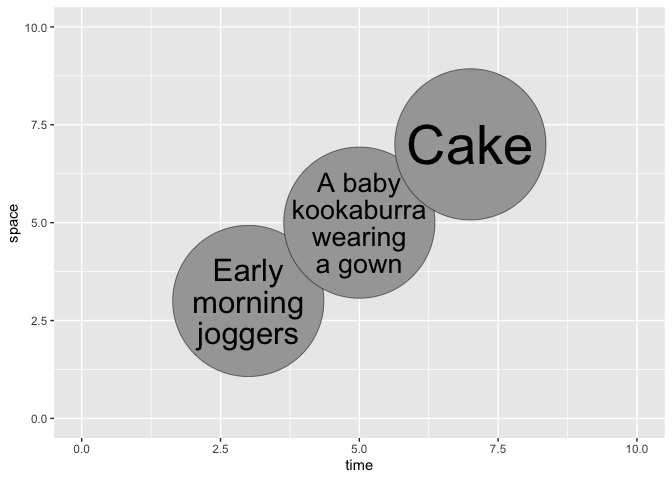

<!-- README.md is generated from README.Rmd. Please edit that file -->

# ggcircumscribe

<!-- badges: start -->

[](https://lifecycle.r-lib.org/articles/stages.html#experimental)
<!-- badges: end -->

ggcircumscribe is a ggplot2 extension for fitting text into circles. It
is derived from [ggfittext](https://wilkox.org/ggfittext). The
inspiration was [the need to label circles in
ggcirclepack](https://github.com/teunbrand/ggplot-extension-club/discussions/15).

## Installation

You can install the development version of ggcircumscribe from
[GitHub](https://github.com/) with:

``` r
# install.packages("devtools")
devtools::install_github("wilkox/ggcircumscribe")
```

ggcircumscribe is not yet on CRAN.

## Usage

The main geom is `geom_circumscribe()`, which shrinks, grows, or reflows
(wraps) text to fit a circle. The radius of the circle is set with an
absolute `grid::unit()` value; this is likely to change in future as use
cases for the package are more clearly defined.

The package also provides `geom_abs_circle()` for drawing circles
defined with plot-scale x and y coordinates but absolute `grid::unit()`
radius.

``` r
library(ggplot2)
library(ggcircumscribe)

example_data <- data.frame(
  time = c(3, 5, 7),
  space = c(3, 5, 7),
  observation = c("Early morning joggers", "A baby kookaburra wearing a gown", "Cake")
)

ggplot(example_data, aes(x = time, y = space, label = observation)) +
  geom_abs_circle(radius = grid::unit(20, "mm")) +
  geom_circumscribe(radius = grid::unit(20, "mm"), grow = TRUE) +
  scale_x_continuous(limits = c(0, 10)) +
  scale_y_continuous(limits = c(0, 10))
#> ! The `reflow` argument is not yet implemented
```



## Roadmap

Currently planned features and changes:

- Implement ‘reflow’ parameter
- Change reflowing algorithm to optimise for a circle rather than a
  square
- Support angled text
- Add tests
