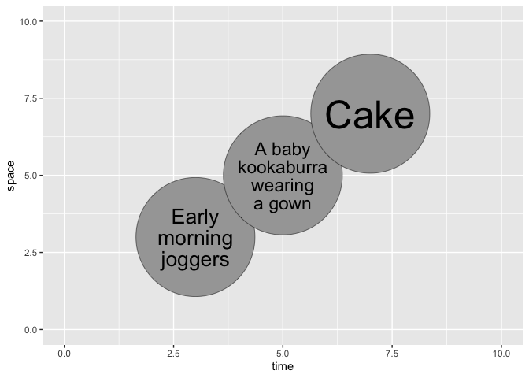

<!-- README.md is generated from README.Rmd. Please edit that file -->

# ggcircumscribe

<!-- badges: start -->
<!-- badges: end -->

ggcircumscribe is a ggplot2 extension for fitting text into circles. It
is derived from [ggfittext](https://wilkox.org/ggfittext). The
inspiration was [the need to label circles in
ggcirclepack](https://github.com/teunbrand/ggplot-extension-club/discussions/15).

## Installation

You can install the development version of ggcircumscribe from
[GitHub](https://github.com/) with:

``` r
# install.packages("devtools")
devtools::install_github("wilkox/ggcircumscribe")
```

ggcircumscribe is not yet on CRAN.

## Example

ggcircumscribe currently provides only one geom, `geom_circumscribe()`.
The radius of the circle in which the text is to be drawn is currently
set as an absolute `grid::unit()` value; this is likely to change in
future as use cases for the package are more clearly defined.

``` r
library(ggplot2)
library(ggcircumscribe)

example_data <- data.frame(
  time = c(3, 5, 7),
  space = c(3, 5, 7),
  observation = c("Early morning joggers", "A baby kookaburra wearing a gown", "Cake")
)

ggplot(example_data, aes(x = time, y = space, label = observation)) +
  geom_abs_circle(radius = grid::unit(20, "mm")) +
  geom_circumscribe(radius = grid::unit(20, "mm"), fontsize = 70) +
  scale_x_continuous(limits = c(0, 10)) +
  scale_y_continuous(limits = c(0, 10))
#> ! The `grow` argument is not yet implemented
#> ! The `reflow` argument is not yet implemented
```



## Roadmap

Currently planned features and changes:

- Implement ‘grow’ and ‘reflow’ parameters
- Change reflowing algorithm to optimise for a circle rather than a
  square
- Support angled text
- Add tests
